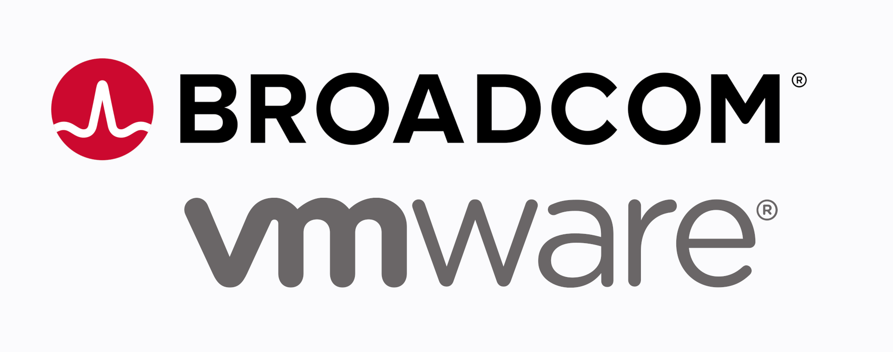
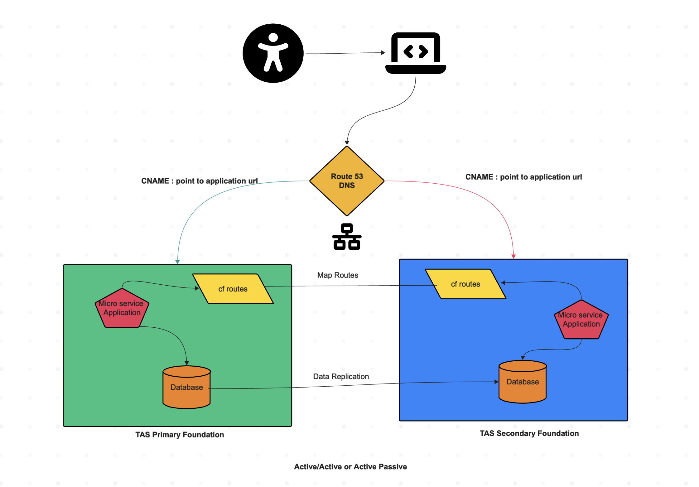
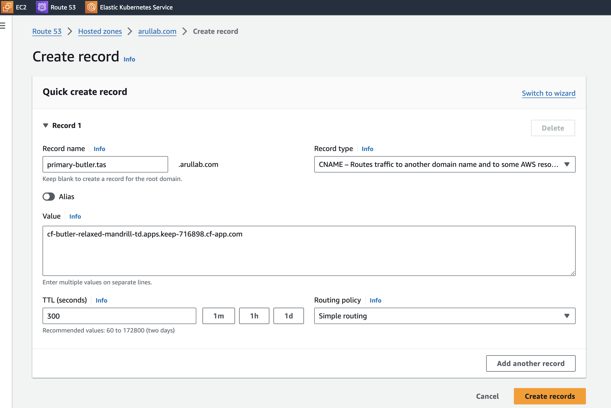

<p align="center">

</p>

<p align="center">

</p>

## Guide to design Active/Active or Active/Passive deployments on Tanzu Application Service (Cloud Foundry)

#### This guide assumes your are deploying both primary and secondary apps in same foundation.


### Deploy the app in Primary Space.
```
avannala@$$$$ cf-butler % cf a
Getting apps in org cf-butler / space dev as admin...

name               requested state   processes           routes
cf-butler          started           web:1/1, task:0/0   cf-butler-relaxed-mandrill-td.apps.keep-active.cf-app.com
cf-hoover          started           web:1/1, task:0/0   cf-hoover-balanced-shark-kv.apps.keep-active.cf-app.com
cf-hoover-ui       started           web:0/1, task:0/0   cf-hoover-ui-insightful-wombat-qv.apps.keep-active.cf-app.com
pivotal-mysqlweb   started           web:1/1, task:0/0   pivotal-mysqlweb-rested-bushbuck-hv.apps.keep-active.cf-app.com
```

### Create a private domain.
```
avannala@$$$$ cf-hoover-ui % cf create-domain cf-butler tas.arullab.com
Creating private domain tas.arullab.com for org cf-butler as admin...
OK

TIP: Domain 'tas.arullab.com' is a private domain. Run 'cf share-private-domain' to share this domain with a different org.
```

```
avannala@$$$$ cf-hoover-ui % cf domains
Getting domains in org cf-butler as admin...

name                          availability   internal   protocols
apps.internal                 shared         true       http
apps.keep-active.cf-app.com   shared                    http
tas.arullab.com               private                   http
```
### Map a DNS route to primary application

```
avannala@$$$$ cf-hoover-ui % cf map-route cf-butler tas.arullab.com --hostname primary-butler
Creating route primary-butler.tas.arullab.com for org cf-butler / space dev as admin...
OK

Mapping route primary-butler.tas.arullab.com to app cf-butler in org cf-butler / space dev as admin...
OK
```


```
avannala@$$$$ cf-hoover-ui % cf a
Getting apps in org cf-butler / space dev as admin...

name               requested state   processes           routes
cf-butler          started           web:1/1, task:0/0   cf-butler-relaxed-mandrill-td.apps.keep-active.cf-app.com, primary-butler.tas.arullab.com
cf-hoover          started           web:1/1, task:0/0   cf-hoover-balanced-shark-kv.apps.keep-active.cf-app.com
cf-hoover-ui       started           web:0/1, task:0/0   cf-hoover-ui-insightful-wombat-qv.apps.keep-active.cf-app.com
pivotal-mysqlweb   started           web:1/1, task:0/0   pivotal-mysqlweb-rested-bushbuck-hv.apps.keep-active.cf-app.com
```
### Updates you DNS  with CNAME records on primary foundation

#### Map primary-butler.tas.arullab.com ---> cf-butler-relaxed-mandrill-td.apps.keep-active.cf-app.com

<p align="center">

</p>

###  Share the route with secondary application
#### Deploying the secondary app in same foundation to different space
```
avannala@$$$$ cf-butler % cf share-route arullab.com --hostname primary -s test -o cf-butler
Sharing route primary.arullab.com to space test as admin
OK
```

### Secondary Space

```
avannala@$$$$ cf-app-failover % cf a
Getting apps in org cf-butler / space test as admin...

name               requested state   processes           routes
cf-butler          started           web:1/1, task:0/0   cf-butler-patient-lynx-vc.apps.keep-active.cf-app.com
pivotal-mysqlweb   started           web:1/1, task:0/0   pivotal-mysqlweb-funny-camel-mg.apps.keep-active.cf-app.com
```

### Map a DNS route to secondary application

```
avannala@$$$$ cf-hoover-ui % cf map-route cf-butler tas.arullab.com --hostname primary-butler
Creating route primary-butler.tas.arullab.com for org cf-butler / space test as admin...
OK

Mapping route primary-butler.tas.arullab.com to app cf-butler in org cf-butler / space test as admin...
OK
```

```
avannala@$$$$ cf-app-failover % cf a
Getting apps in org cf-butler / space test as admin...

name               requested state   processes           routes
cf-butler          started           web:1/1, task:0/0   cf-butler-patient-lynx-vc.apps.keep-active.cf-app.com, primary-butler.tas.arullab.com
pivotal-mysqlweb   started           web:1/1, task:0/0   pivotal-mysqlweb-funny-camel-mg.apps.keep-active.cf-app.com
```

### Now you have active-active deployments

#### Access the app via https://primary-butler.tas.arullab.com this will route to application url on TAS

### Consider Data replication
